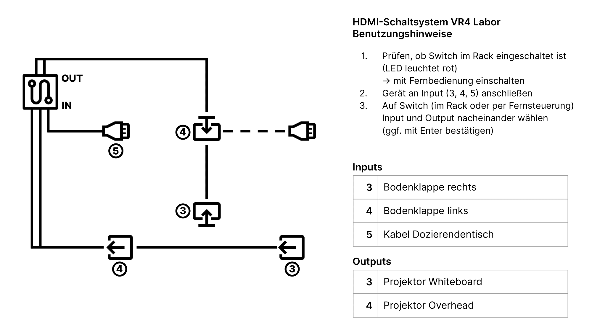

# HDMI Hub und Matrix

<!-- *Bilder/Diagramme, Schaltpläne, etc. (wo sinnvoll) einfügen* -->

<!-- → Verwendung: Was macht das? Wie kann man das benutzen?, … -->
<!-- - Nutzung des HDMI-Switches um leicht zwischen verschiedenen HDMI Ein- und Ausgabeports zu wechseln
- Umstellen möglich über ioBroker -->

Die Matrix (innerhalb des Serverkastens) kann genutzt werden um leicht zwischen verschiedenen HDMI Ein- und Ausgabeports zu wechsel. Dazu wurden Kabel zu den zwei Bodenplatten im Labor und zur Tafel verlegt, über die auf die zwei Beamer zugegriffen werden kann.
Die Ports können über ioBroker oder im Raum direkt umgestellt werden.

### Aufbau
<!-- → z.B.: Verkabelung, Infrastruktur, Ort,  -->
<!-- - [PureTools 8x8 HDMI 2.0 Matrix](https://www.purelink.de/marketing/datenblaetter/PureTools_Datasheets/DE/PT-MA-HD88UHD_Datasheet_DE.pdf)
- Steuerung in ioBroker über TCP Requests mithilfe eines Skripts:
  - LINK Script 
  - TCP Request werden aus Eingaben der Outputs/Inputs generiert und dann an die Matrix geschickt -->

Die [PureTools 8x8 HDMI 2.0 Matrix](https://www.purelink.de/marketing/datenblaetter/PureTools_Datasheets/DE/PT-MA-HD88UHD_Datasheet_DE.pdf) wird in ioBroker über TCP Requests gesteuert. Dazu wird ein Skript (LINK) verwendet, dass über veränderbare Objekte Befehle generiert.

Relevante IP-Adressen:

|  Gerät  | IP-Adresse  |
|---------|-------------|
| Matrix  | 192.168.2.13|
| Switch  | 192.168.2.13 (Port 4001) |
| Router  | http://192.168.2.1/cgi-bin/luci |

### Wartung und Troubleshooting
<!-- → Wie kommt man ran?, Was kann man einfach ändern?, Bugs, die uns begegnet sind und wie sie gelöst wurden, … -->
<!-- - TCP Requests geben immer zuerst die Zeile: "Please Input Your Command :" zurück. Diese muss anfangs abgefangen werden -->
Zu beachten ist vor allem, dass TCP Requests immer zuerst die Zeile: "Please Input Your Command :" zurück. Diese muss abgefangen werden, bevor man den richtigen Befehl sendet.
Dieser Befehl muss mit einem Punkt enden.

Kommunikation mit der Matrix geht auch über:
- eine Fernbedienung (keine große Reichweite)
- die offizielle [GUI](http://192.168.2.13/)
- mit [netcat](https://nmap.org/ncat/) oder ähnlichen Tools:
  - `nc 192.168.2.13 4001` oder `ncat 192.168.2.13 4001` (windows)
  - Die wichtigsten Befehle (Punkt nicht vergessen!): 
    - `Status.`
    - `[In]V[Out].` (z.B.: 5V4.)
  - TODO: Link zu Manual

---

#### Anmerkungen
<!-- → Zusätzlicher Punkt für Notizen/Anmerkungen, etc. (wenn nichts wichtiges, dann weglassen) -->
<!-- - Visualisierung der HDMI-Verbindungen über ein Data-Flow-Diagramm:
  - Aktuelle Verbindungen werden farblich hervorgehoben und wird ein Kabel für den Beamer benutzt wird dieses animiert
  - TODO: BILD
- Um den aktuellen Status der Matrix widerzuspiegeln läuft auf ioBroker ein Skript, dass alle 5min (Arbeitstag) den Status von der Matrix abfragt
- TCP Anfragen werden direkt im Script ausgeführt, können aber auch über Node-Red getätigt werden
- Die HDMI Kabelnummern und Inputnummern der Matrix stimmern überein, also z.B.: HDMI 3 auf Input 3 der Matrix
  - ABER: Input 5 der Matrix funktioniert nicht, deswegen wurde das HDMI Kabel 5 auf Input 1 verlegt. Dies wird im Script matrix-switcher.js in ioBroker abgefangen. Hier wird die 5 (die sonst überall drin steht) für den eigentliche Matrix Command mit einer 1  ausgetauscht -->

Die Visualisierung der HDMI-Verbindungen in ioBroker wurde mit einem Data-Flow-Diagramm gelöst. 
Aktuelle Verbindungen werden farblich hervorgehoben. Wird ein Kabel für den Beamer benutzt wird dieses animiert.
Um den aktuellen Status der Matrix widerzuspiegeln läuft auf ioBroker ein Skript, dass alle 5min (an Arbeitstagen) den Status von der Matrix abfragt.
TCP Anfragen werden direkt im Script ausgeführt, können aber auch über Node-Red getätigt werden.

Die HDMI Kabelnummern und Inputnummern der Matrix stimmen überein, also ist etwa das HDMI 3-Kabel auf den Input 3 der Matrix gesteckt.
Ausnahme ist das Kabel 5, da der Input 5 der Matrix nicht zu funktionieren scheint. Deswegen wurde Kabel 5 auf Input 1 verlegt. Dies wird im Script matrix-switcher.js in ioBroker abgefangen. Hier wird die 5 (die sonst überall drin steht) für den eigentliche Matrix Command mit einer 1 ausgetauscht.

#### Ressourcen 
<!-- → Verwendete Tutorials, Materialien, Quellenangaben, etc. (wenn nichts wichtiges, dann weglassen) -->
- netcat: https://nmap.org/ncat/
- gui: http://192.168.2.13/
- HDMI Matrix Produktbeschreibung: https://www.purelink.de/marketing/datenblaetter/PureTools_Datasheets/DE/PT-MA-HD88UHD_Datasheet_DE.pdf
- Data Flow Visualisierung für ioBroker vis: https://forum.iobroker.net/topic/43770/data-flow-animation-html-widgets

