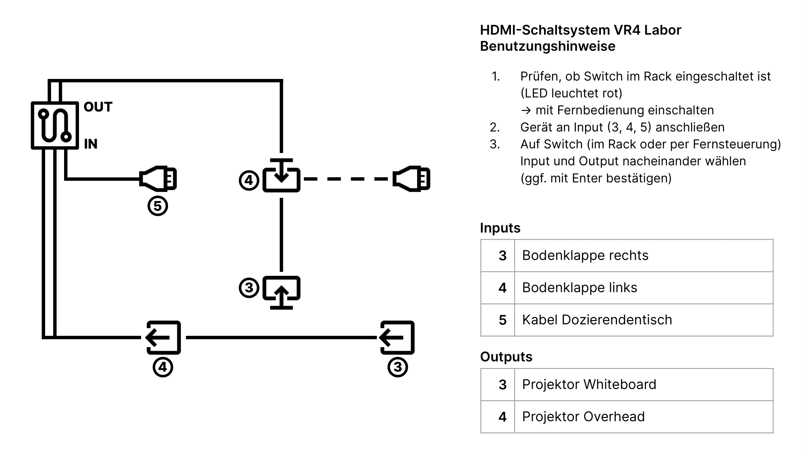

# projectorcontrol

*Bilder/Diagramme, Schaltpläne, etc. (wo sinnvoll) einfügen*

<!-- → Verwendung: Was macht das? Wie kann man das benutzen?, … -->
- Möglichkeit die zwei Projektoren (3 = Boden, 4 = Tafel) an-/auszuschalten
- in ioBroker-Dashboard über Buttons steuerbar
- Status wird über ein Script in ioBroker ausgelesen und aktualisiert

### Aufbau
<!-- → z.B.: Verkabelung, Infrastruktur, Ort,  -->
- Raspberry Pi über Serial-Verbindung an Beamer gehängt (1 pro Beamer)
- Script mit [paho-mqtt](https://pypi.org/project/paho-mqtt/) und [pySerial](https://pyserial.readthedocs.io/en/latest/index.html)
  - empfängt und sendet MQTT Nachrichten über Power on/off-Befehle und Statusabfragen
  - RS232-Befehle an Beamer über Serial-Schnittstelle mithilfe von HexCodes
  - LINK ZU (BSP-)SCRIPT (TODO)
  - Status wird über ein ioBroker Script im 5min Takt abgefragt, damit die Visualisierung und die Realität übereinstimmen
- Raspi-Script ist autostart

### Wartung und Troubleshooting
<!-- → Wie kommt man ran?, Was kann man einfach ändern?, Bugs, die uns begegnet sind und wie sie gelöst wurden, … -->

- Status von Beamer kann nicht ausgelesen werden, wenn diese gerade hoch-/runterfährt
  - Deswegen ist im Skript ein 30sec sleep eingebaut, bevor die Serielle Schnittstelle wieder geschlossen wird
- Probleme mit Beamer 4 (Tafel) / Raspi 114
- Erst Serial anschließen, dann Strom — ansonsten ist erst beim Booten kein Gerät per Serial verbunden und Skript schmeißt einen Fehler.

#### Zugang über ssh
- **IP-Adressen** der Raspis:
  - 564 = projectorcontrol-3, 192.168.2.113
  - 566 = projectorcontrol-4, 192.168.2.114
- Credentials: 
  - user: projectorcontrol
  - pw: apfelsaftschorle
- z.B.: `ssh projectorcontrol@192.168.2.113` → pw
- Aktuelle python Prozesse ausgeben: `ps -aux | grep python`
- projectorcontrol-3 hat eine log-Datei:
  - `/home/projectorcontrol/Dokumente/proj3.log`

#### Topics
| Topic                  | Message    | Aktion                   |
| ---------------------- | ---------- | ------------------------ |
| projector/3/out/power  | true/false | Beamer 3 an-/ausschalten |
| projector/3/out/status | true/false | Status 3 abfragen        |
| projector/3/out/power  | true/false | Beamer 3 an-/ausschalten |
| projector/3/in/status  | true/false | Status 3 zurückgeben     |
| projector/4/out/power  | true/false | Beamer 4 an-/ausschalten |
| projector/4/out/status | true/false | Status 4 abfragen        |
| projector/4/in/status  | true/false | Status 4 zurückgeben     |

#### Kommunikation über Serial Kabel
- Beamer → Serial Kabel → Serial auf USB Adapter → USB-A F auf M Kabel → PC
- Mit [CoolTerm](https://freeware.the-meiers.org/):
  - "Send String"/"Neuen String" + Hex-Input
  - Power ON: 0614000400341100005D
  - Power OFF: 0614000400341101005E
  - HEXcodes aus der [Doku](https://viewsonicvsa.freshdesk.com/support/solutions/articles/43000470420-viewsonic-projector-rs232-protocol) (S.17), mit 0x und Leerzeichen entfernt.

---

#### Anmerkungen
<!-- → Zusätzlicher Punkt für Notizen/Anmerkungen, etc. (wenn nichts wichtiges, dann weglassen) -->

- Anschluss der Pis an die Projektoren geht nur mit Serial-Kabel, Adapter direkt an Beamer klappt nicht 
- Installation eines Hardware [Watchdogs](https://diode.io/blog/running-forever-with-the-raspberry-pi-hardware-watchdog) auf 114 
  - auf 113 hats nicht geklappt

##### Einen Raspi einrichten
- Debian 12 Installieren (Bookworm) und Raspi einrichten
- Script hochladen (z.b.: mit USB-Stick) und wenn nötig anpassen (z.B.: Topics updaten)
- im Terminal:
  - `sudo apt install python3-paho-mqtt` (via: sudo apt search paho-mqtt)
  - Autorun einrichten ([Anleitung](https://www.dexterindustries.com/howto/run-a-program-on-your-raspberry-pi-at-startup/))
  - in rc.local: `sudo python3 /home/projectorcontrol/Dokumente/projector-control-3.py &`

#### Ressourcen 
<!-- → Verwendete Tutorials, Materialien, Quellenangaben, etc. (wenn nichts wichtiges, dann weglassen) -->
- paho-mqtt: https://pypi.org/project/paho-mqtt/
- pySerial: https://pyserial.readthedocs.io/en/latest/index.html
- ViewSonic RS232 protocol: https://viewsonicvsa.freshdesk.com/support/solutions/articles/43000470420-viewsonic-projector-rs232-protocol
- Beamer User Guide: https://www.viewsonicglobal.com/public/products_download/user_guide/Projector/LS700-4K/LS700-4K_UG_ENG.pdf?pass
- Warum kein D1 mini: https://forum.arduino.cc/t/how-to-wire-rs232-serial-to-rx-tx/26212
- CoolTerm: https://coolterm.en.lo4d.com/windows, https://freeware.the-meiers.org/
- Autorun: https://www.dexterindustries.com/howto/run-a-program-on-your-raspberry-pi-at-startup/
- Hardware Watchdog: https://pimylifeup.com/raspberry-pi-watchdog/, https://diode.io/blog/running-forever-with-the-raspberry-pi-hardware-watchdog
- 