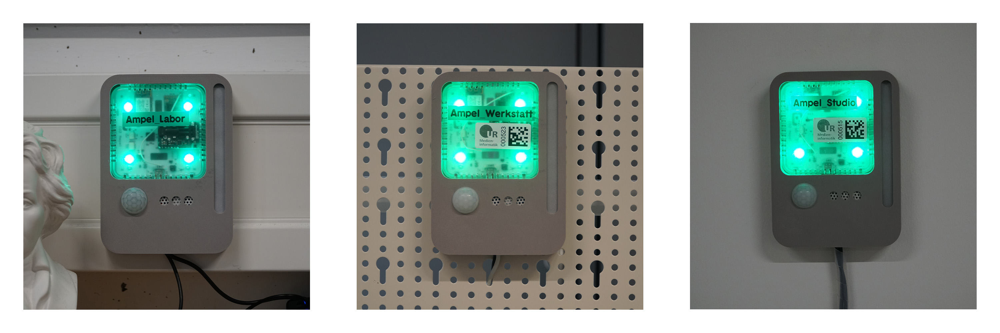

# Sensorkit

<!-- *Bilder/Diagramme, Schaltpläne, etc. (wo sinnvoll) einfügen* -->

<!-- → Verwendung: Was macht das? Wie kann man das benutzen?, … -->
In jedem der drei Zimmer des VR4 hängt ein Sensorkit an der Wand.
Im Sensorkit sind drei verschiedene Funktionen in einem Case vereint:
- Bewegungssensor (LINK)
- CO2-Ampel (LINK)
- Klingelwarnsystem (LINK)

Für normale Raumnutzer sind nur die Farbe der CO2-Ampel als Lüftungsindikator und das Klingelwarnsystem relevant, welches piepst und/oder blau aufleuchtet, wenn die zugehörige Klingel ausgelöst wurde.

### Aufbau
<!-- → z.B.: Verkabelung, Infrastruktur, Ort,  -->

Im 3D-gedruckten Gehäuse befinden sich ein Wemos D1 Mini, ein PIR-Bewegungssensor, ein Wemos Buzzer Shield, ein LED-Streifen sowie die Watterott CO2-Ampel. 
Betrieben werden sie durch ein USB-C-Kabel (CO2-Ampel) und ein micro-USB-Kabel (D1 Mini). 
Zum Auslesen des Bewegungssensors und Kommunikation der Klingel wurden entsprechende Sensoren und Outputs an den D1 Mini verlötet.

Die Verbindung zum IOBroker verläuft für beide Geräte kabellos.
Die CO2-Ampel sendet an ein entsprechendes topic `/mqtt/0/CO2-Ampel/Ampel_{Raum}` alle X Sekunden Daten zu Temperatur, Luftfeuchtigkeit, CO2-Konzentration und Helligkeit im Raum.
Auf dem D1 mini läuft das Skript `doorbell-pir.ino`, welches die Funktionen zum Hochladen der Bewegungsdaten und Auslesen und Handeln der Klingelsignale vereint. 

### Wartung und Troubleshooting
<!-- → Wie kommt man ran?, Was kann man einfach ändern?, Bugs, die uns begegnet sind und wie sie gelöst wurden, … -->
Das Gehäuse des Sensorkits ist nur zusammengesteckt, was Änderungen und Reparaturen sehr einfach macht.
> Beim Öffnen bitte beachten, dass der Infrarotsensor samt Kabeln im vorderen Teil des Gehäuses hängt!

#### Troubleshooting-Schritte
##### CO2-Ampel
- Falls Licht aus ist:
  - Gehäuse öffnen
  - Stromverbindung prüfen
  - Durch Drücken der Reset-Taste (linke Seite) neustarten
- Falls Werte falsch wirken:
  - mit externem Sensor über längere Zeit kontrollieren und eventuelle Offsets in **LINK ZUM SKRIPT** eintragen.

##### Klingelwarnsystem und Bewegungssensor
> Die Klingel braucht nach dem Anschalten eine kurze Weile (<60s), um sich mit dem Router zu verbinden. In dieser Zeit sendet sie noch keine Signale an IOBroker, weswegen das Klingelwarnsystem noch nicht reagiert.
> Das Klingelwarnsystem fragt im `loop()` den Status der Klingel ab, was unter Umständen zu leicht asynchronem Blinken oder Piepen führen kann.
- Falls nur die LEDs blinken:
  - Prüfen, ob die Studienlampe an ist
  - Prüfen, ob die Variable für die Studienlampe im Webinterface auf `true` steht
  - Hardwareverbindungen prüfen
- Falls Klingelwarnsystem gar nicht reagiert:
  - Prüfen, ob D1 Mini mit Strom (blaue LED auf dem Mainboard) und Netzwerk (Router-Interface) verbunden ist   
  - Hardwareverbindungen prüfen
- Falls Bewegungssensor nicht angezeigt wird
  - Variable **NAME** für den Raum prüfen
  - D1 Mini neu starten und prüfen, ob "Hello World" ins Topic geschrieben wird
  - Hardwareverbindungen prüfen
    
---

#### Anmerkungen
<!-- → Zusätzlicher Punkt für Notizen/Anmerkungen, etc. (wenn nichts wichtiges, dann weglassen) -->

#### Ressourcen 
<!-- → Verwendete Tutorials, Materialien, Quellenangaben, etc. (wenn nichts wichtiges, dann weglassen) -->

